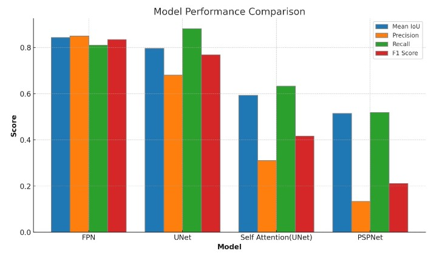

# Breast Tumor Segmentation
Flask app for Breast Tumor Segmentation using FPNet, other models as evaluated for the task are present in the models.ipynb file. 

## Results of various models

### Results Table

### Results Plot

